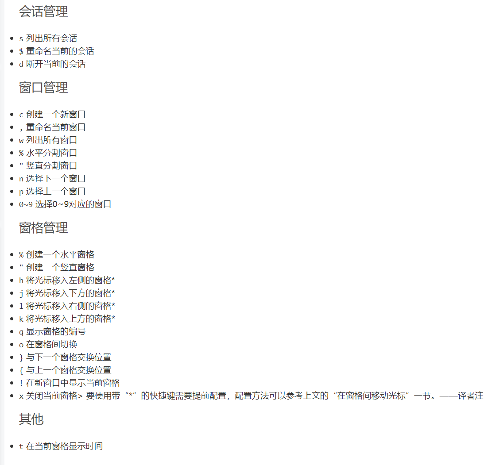

# TMUX

tmux是一个插件。 作用简单来说就是在一个cmder可以运行多个程序，即把部分程序放到后台运行（例如：网址运行程序）。我用于防止云服务器断开连接（云服务器在你一段时间没有行动后会自动断开连接）

[入门博客](https://blog.csdn.net/skykingf/article/details/46345057) 


在Tmux逻辑中，需要分清楚Server > Session > Window > Pane这个大小和层级顺序是极其重要的，直接关系到工作效率：

- Server：是整个tmux的后台服务。有时候更改配置不生效，就要使用tmux kill-server来重启tmux。
- Session：是tmux的所有会话。我之前就错把这个session当成窗口用，造成了很多不便里。一般只要保存一个session就足够了。
- Window：相当于一个工作区，包含很多分屏，可以针对每种任务分一个Window。如下载一个Window，编程一个window。
- Pane：是在Window里面的小分屏。最常用也最好用

了解了这个逻辑后，整个Tmux的使用和配置也就清晰了。
 （ps：下面这种方便好看的Status bar状态栏，显示的是windows，而不是sessions）


## 基本用法:

ctrl+b是tmux的快捷键开始键（即快捷键为ctrl+b 再按其他键）

1. tmux ls 查看目前session
2. tmux new -s session-name 新建session
3. tmux a -t session-name 接入session（就是进入session）
4. tmux detach（快捷键：ctrl+b d）断开session（退出窗口）
5. tmux kill-session -t session-name 删除session（删除这个窗口（进程））


# 常用

```
ctrl+b ? 显示快捷键帮助文档
ctrl+b d 断开当前会话
ctrl+b 方向键 切换面板
ctrl+b pageup 可以浏览terminal翻页  比较麻烦? 
ctrl+b s 选择会话
ctrl+b : 进入命令行模式(还没怎么用)
ctrl+b x 关闭面板
ctrl+b t 显示时间


```

```bash
./configure CFLAGS="-I$HOME/.local/include -I$HOME/.local/include/ncurses" LDFLAGS="-L$HOME/.local/lib -L$HOME/.local/include/ncurses -L$HOME/.local/include" CPPFLAGS="-I$HOME/.local/include -I$HOME/.local/include/ncurses" LDFLAGS="-static -L$HOME/.local/include -L$HOME/.local/include/ncurses -L$HOME/.local/lib" 
```

这代码还能编译错误... 

```
netsamir@octopus:~/$ export CPPFLAGS="-P"
```

加完这句话需要重新 configure 


## 其他快捷键：




# .tmux.conf

里面有个zsh如果没有就要删掉, 

有几行是无法编译和使用的, 我直接注释掉, 就可以跑起来了


现在可以用鼠标点击

```
#将r 设置为加载配置文件，并显示"reloaded!"信息
bind r source-file ~/.tmux.conf \; display "Reloaded!"


# Use Shift-arrow keys to switch panes
bind -n S-Left select-pane -L
bind -n S-Right select-pane -R
bind -n S-Up select-pane -U
bind -n S-Down select-pane -D

# Alt-arrow to switch windows
bind -n M-Left previous-window
bind -n M-Right next-window


#Enable mouse mode (tmux 2.1 and above)
setw -g mouse on
set -g mouse on

#Enable oh my zsh in tmux
# set -g default-command /bin/zsh
set -g default-command /bin/bash

# Mouse based copy
# bind-key -T copy-mode-vi MouseDragEnd1Pane send -X copy-pipe-and-cancel "reattach-to-user-namespace pbcopy"
# bind-key -T copy-mode MouseDragEnd1Pane send -X copy-pipe-and-cancel "reattach-to-user-namespace pbcopy"  

#开启status-bar uft-8支持  
# set -g status-utf8 on


#设置终端颜色为256色  
set -g default-terminal "screen-256color"
#开启status-bar uft-8支持  
# set -g status-utf8 on  
#设置pan前景色  
set -g pane-border-fg green
#设置pane背景色  
set -g pane-border-bg black
#设置活跃pane前景色  
set -g pane-active-border-fg white
#设置活跃pane背景色  
set -g pane-active-border-bg yellow
#设置消息前景色  
set -g message-fg white
#设置消息背景色  
set -g message-bg black
#设置消息高亮显示  
set -g message-attr bright
#设置status-bar颜色  
set -g status-fg white
set -g status-bg black
#设置窗口列表颜色  
setw -g window-status-fg cyan
setw -g window-status-bg default
setw -g window-status-attr dim
#设置当前窗口在status bar中的颜色  
setw -g window-status-current-fg white
setw -g window-status-current-bg red
setw -g window-status-current-attr bright
#设置status bar格式  
set -g status-left-length 40
set -g status-left "#[fg=green]Session: #S #[fg=yellow]#I #[fg=cyan]#P"
set -g status-right "#[fg=cyan]%b %d %R"
set -g status-interval 60
set -g status-justify centre

```

